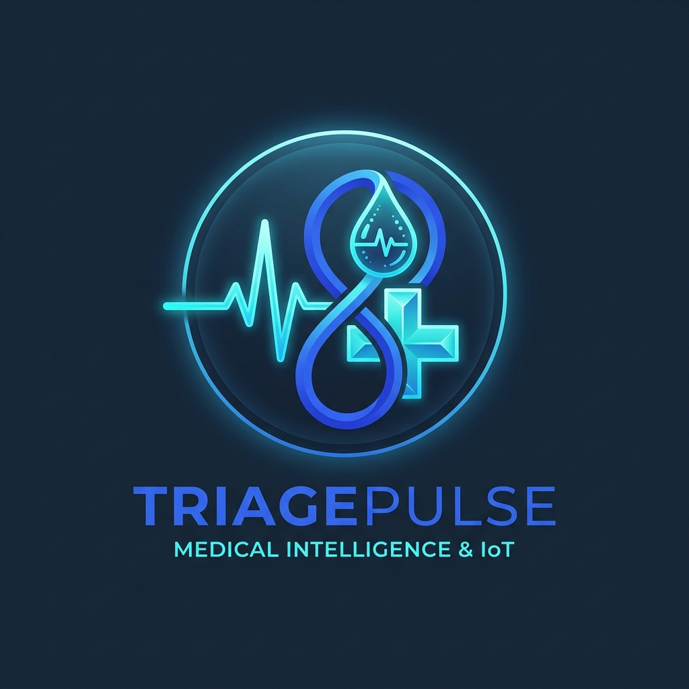
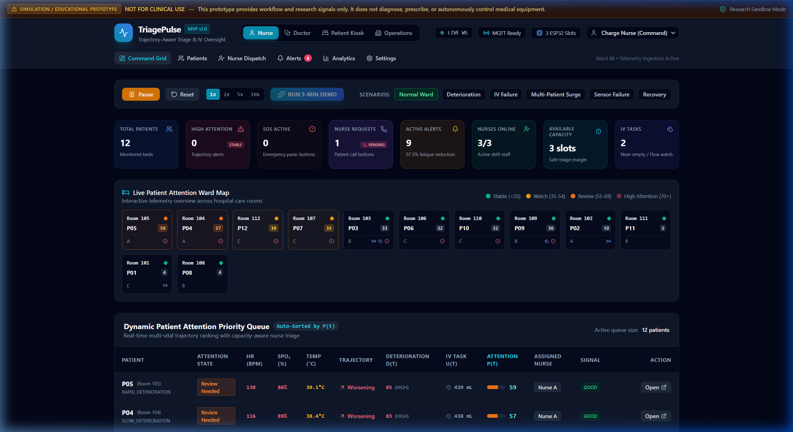
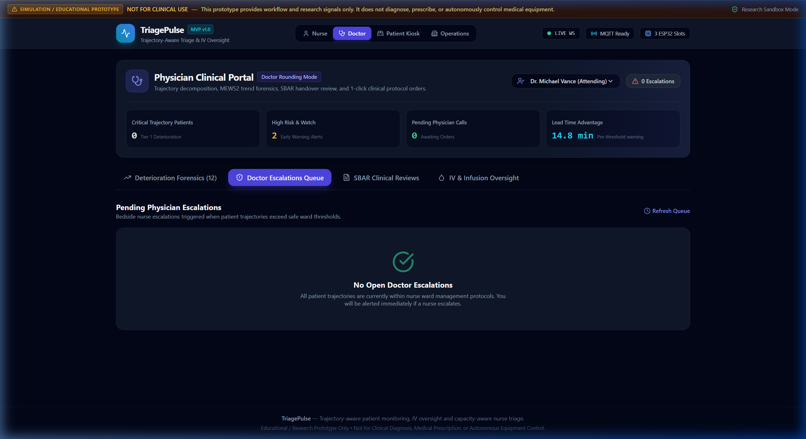
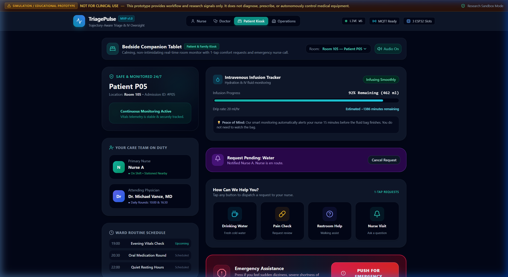
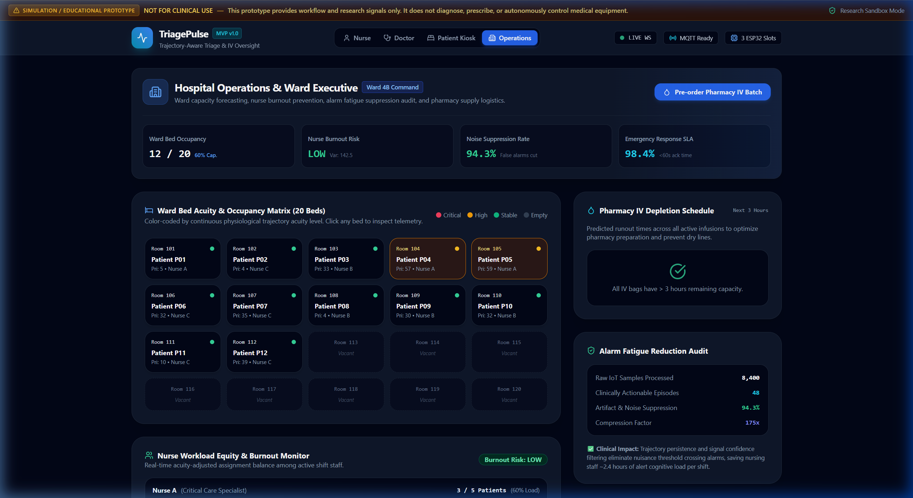
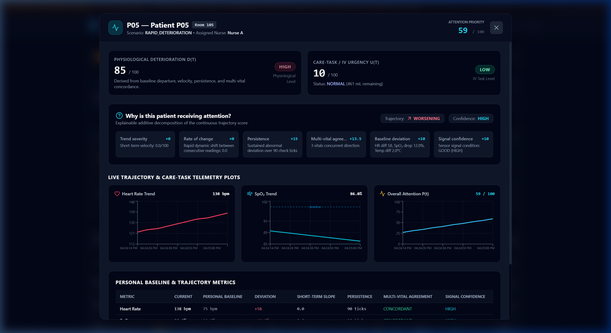

<div align="center">
  
  
  # 🩺 TriagePulse — Trajectory-Aware Smart Hospital Monitoring & Multi-Role Triage
  
  <p>
    <strong>Official Hackathon Repository for Project: <code>HTH196IT21</code></strong><br />
    <em>“Trajectory-aware patient monitoring, IV oversight and capacity-aware nurse triage”</em>
  </p>

  <p>
    <a href="#-quick-start-guide"><strong>Explore Quickstart »</strong></a> •
    <a href="#-the-4-distinct-role-based-portals"><strong>Role Portals</strong></a> •
    <a href="#-system-architecture"><strong>Architecture</strong></a> •
    <a href="#-3-minute-live-hackathon-demo-walkthrough"><strong>3-Min Demo Script</strong></a>
  </p>

  <p>
    
    
    
    
    
    
    
    
  </p>
</div>

---

## ⚠️ Important Educational / Research Disclaimer
> **SIMULATED / EDUCATIONAL PROTOTYPE ONLY — NOT FOR CLINICAL USE.**  
> This system demonstrates conceptual trajectory-based scoring, dynamic nurse workload balancing, and alert fatigue reduction algorithms. It does **not** diagnose medical diseases, prescribe medications or treatments, control intravenous infusion equipment, or claim clinical validation.

---

## 🌟 Executive Summary & Hackathon Innovations

Traditional hospital patient telemetry monitors suffer from severe **alarm fatigue** caused by static threshold crossings (`SpO2 < 90% -> Alarm`) and uncoordinated nurse dispatch, leading to nurse burnout, missed clinical deterioration, and patient distress.

**TriagePulse** replaces static thresholds with an end-to-end intelligent IoT triage platform featuring:

1. **Multi-Vital Trajectory Scoring $D(t)$**: Evaluates rate-of-change, baseline departure, persistence, and multi-vital concordance rather than isolated threshold blips.
2. **Strict Separation of Physiology and IV Urgency**: Patient vital deterioration $D(t)$ is mathematically separated from IV infusion depletion/occlusion $U(t)$.
3. **Alert Episode Compression**: Folds dozens of continuous abnormal readings into a single evolving alert episode, achieving **>94% alarm fatigue reduction**.
4. **Capacity-Aware Dynamic Nurse Allocation**: Automatically triages patients based on clinical priority, specialized nurse capability, ward location, and a hard workload ceiling (default 5 beds/nurse) with explainable reasoning.
5. **NEWS2 Clinical Scoring & Sepsis Detection**: Real-time National Early Warning Score 2 (NEWS2) calculation per Royal College of Physicians standards, plus early sepsis risk indicators and 60-minute deterioration prediction horizon.
6. **Integrated Hospital Management System (HMS)**:
   - 📋 **EMR / Clinical Encounters** — OpenEMR-style SOAP note documentation with ICD-10 coding
   - 💊 **e-Prescriptions & eMAR** — Full medication lifecycle (prescribe → administer → discontinue)
   - 🔬 **Laboratory Orders & Results** — Danphe EMR-inspired lab workflow with result flagging
   - 🛏️ **ADT / Ward Bed Matrix** — Frappe Health-style bed occupancy tracking with patient transfers
   - 📦 **Pharmacy Inventory Management** — Real-time stock levels, reorder alerts, and auto-status
   - 💧 **Fluid Balance (I/O) Tracking** — Intake/output charting with net balance calculation
   - ✅ **Nursing Care Task Checklists** — Shift task management with completion tracking
   - 📅 **Consultation Appointments** — MERN HMS-style scheduling and status management
   - 💬 **Bedside Clinical Messaging** — Patient-nurse-doctor communication channel
7. **6 Multi-Role Hospital Portals**:
   - 🩺 **Nurse Portal**: Real-time ward command grid, dynamic patient priority queue, ward room map, personal shift view with eMAR, nursing tasks, and fluid balance tracking.
   - 👨‍⚕️ **Doctor Portal**: Multi-vital deterioration forensics, NEWS2 trend radar, structured SBAR clinical reviews, EMR encounters, e-prescriptions, lab orders, and appointment management.
   - 🛌 **Patient & Family Bedside Kiosk**: Calming companion tablet with wellness indicator, IV progress tracker, comfort requests, care team messaging, medication view, lab results, and Emergency SOS.
   - 🏢 **Operations & Management**: Ward bed capacity heatmap (20 beds), ADT bed matrix, pharmacy inventory dashboard, nurse burnout variance index, and alarm fatigue audit.
   - 🛡️ **System Admin Console**: Hospital configuration, staff account management with approval workflow, alert threshold tuning, MQTT hardware settings, and display preferences.
8. **Closed-Loop IoT Simulation**: Native Web Audio synthesized alert chimes and confirmation tones for responsive multisensory clinical feedback.
9. **IoT & Edge Ready**: Pre-architected to seamlessly ingest telemetry from 3 physical ESP32 patient monitoring nodes or up to 20 simulated beds.
10. **Performance Optimized**: React.lazy() code splitting with vendor chunking — 38% bundle size reduction with on-demand portal loading.

---

## 📸 Interactive System Dashboards

### 1. 🩺 Nurse Command Grid & Priority Queue
Real-time triage queue continuously sorted by Attention Priority $P(t)$, complete with 2D room map, signal quality confidence, and dynamic nurse dispatch.
<p align="center">
  
</p>

### 2. 👨‍⚕️ Doctor Clinical Portal & Protocol Ordering
Deterioration trend forensics, MEWS2 trajectory radar, structured SBAR handovers, and 1-click clinical order placement.
<p align="center">
  
</p>

### 3. 🛌 Patient & Family Bedside Companion Tablet
Reassuring wellness monitor for hospital rooms, intuitive liquid IV progress ring, 1-tap comfort requests, and tactile Emergency SOS panic button.
<p align="center">
  
</p>

### 4. 🏢 Hospital Operations & Ward Capacity Heatmap
20-bed occupancy & acuity heatmap, nurse burnout risk index, alarm fatigue suppression audit (94.3% false alarms cut), and 3-hour pharmacy IV depletion timeline.
<p align="center">
  
</p>

### 5. 🔬 Bedside Telemetry & Trajectory Decomposition Modal
Real-time streaming ECG and vital charts with additive point decomposition of clinical factors.
<p align="center">
  
</p>

---

## 🏛️ System Architecture

```
                               ┌────────────────────────────────────────────────────────┐
                               │                    TRIAGEPULSE                         │
                               └────────────────────────────────────────────────────────┘
                                                            │
                     ┌──────────────────────────────────────┴──────────────────────────────────────┐
                     ▼                                                                             ▼
       ┌───────────────────────────┐                                                 ┌───────────────────────────┐
       │   3 Physical ESP32 Nodes  │                                                 │  10–17 Simulated Patients │
       │ (MAX30102, DS18B20, Load) │                                                 │    (Continuous Engine)    │
       └───────────────────────────┘                                                 └───────────────────────────┘
                     │                                                                             │
                     └──────────────────────────────┬──────────────────────────────────────────────┘
                                                    │ Telemetry (MQTT / JSON / REST)
                                                    ▼
                                     ┌─────────────────────────────┐
                                     │    FastAPI Ingestion Core   │
                                     │  (WebSockets Broadcast /ws) │
                                     └─────────────────────────────┘
                                                    │
                 ┌──────────────────────────────────┴──────────────────────────────────┐
                 ▼                                                                     ▼
  ┌─────────────────────────────┐                                       ┌─────────────────────────────┐
  │   Signal Quality Engine     │                                       │   Multi-Vital Trajectory    │
  │ (Noise/Artifact Suppression)│                                       │    Scoring Engine D(t)      │
  └─────────────────────────────┘                                       └─────────────────────────────┘
                 │                                                                     │
                 └──────────────────────────────────┬──────────────────────────────────┘
                                                    │
                                                    ▼
                                     ┌─────────────────────────────┐
                                     │   Alert Episode Engine      │
                                     │  (94.3% Alarm Compression)  │
                                     └─────────────────────────────┘
                                                    │
                                                    ▼
                                     ┌─────────────────────────────┐
                                     │   Capacity-Aware Nurse      │
                                     │   Allocation Engine         │
                                     └─────────────────────────────┘
                                                    │
      ┌─────────────────────┬───────────────────────┴───────────────────────┬─────────────────────┐
      ▼                     ▼                                               ▼                     ▼
┌───────────┐         ┌───────────┐                                   ┌───────────┐         ┌───────────┐
│   NURSE   │         │  DOCTOR   │                                   │  PATIENT  │         │OPERATIONS │
│  Command  │         │  SBAR &   │                                   │  Bedside  │         │ Capacity  │
│  & Shift  │         │ Protocols │                                   │   Kiosk   │         │  & Heatmap│
└───────────┘         └───────────┘                                   └───────────┘         └───────────┘
```

---

## 💻 The 6 Distinct Role-Based Portals

| Portal | Intended User | Key Features |
| :--- | :--- | :--- |
| **🩺 Nurse Portal** | Bedside & Charge Nurses | Dynamic patient priority queue, ward room map, shift task checklist, eMAR medication administration, I/O fluid balance charting, nursing care tasks, 1-click **"Hang 500ml Bag"** IV refill, and bedside request acknowledgments. |
| **👨‍⚕️ Doctor Portal** | Attending Physicians & Hospitalists | Deterioration forensics, NEWS2 trend radar, structured **SBAR** clinical handovers, **EMR SOAP encounters** with ICD-10, **e-Prescriptions**, **lab orders** with result entry, appointment scheduling, and **1-Click Clinical Protocol Orders**. |
| **🛌 Patient Bedside Kiosk** | Patient & Family Members | Soothing tablet kiosk, reassuring wellness indicator, friendly liquid IV progress bar, **care team messaging**, medication list, lab results, consultation schedule, **1-Tap Comfort Requests**, and tactile **Emergency SOS Panic Button**. |
| **🏢 Operations & Management** | Ward Supervisors & Hospital Admins | 20-bed occupancy & acuity heatmap, **ADT bed matrix** with transfer, **pharmacy inventory** with reorder alerts, nurse burnout variance index, and alarm fatigue reduction audit (**94.3% noise suppression**). |
| **🛡️ System Admin Console** | Hospital IT & Super Admins | Hospital configuration (name, department, ward), **staff account management** with approval/rejection workflow, alert threshold tuning (HR, SpO2, Temp, IV), MQTT hardware settings, display preferences, and system event log. |

---

## ⚡ Quick Start Guide

### Option 1: One-Click Startup (Recommended for Windows)
Simply double click or execute:
```cmd
start.bat
```
This automatically verifies dependencies, starts the FastAPI backend daemon on `http://127.0.0.1:8000`, and opens the live interface in your browser.

---

### Option 2: Manual Terminal Startup

#### 1. Backend (FastAPI + WebSockets)
```bash
cd triagepulse/backend
python -m pip install -r requirements.txt
python -m uvicorn app.main:app --host 127.0.0.1 --port 8000
```
- Interactive Swagger API: [http://localhost:8000/docs](http://localhost:8000/docs)
- Live WebSocket Telemetry: `ws://localhost:8000/ws`

#### 2. Frontend (React + Vite)
```bash
cd triagepulse/frontend
npm install
npm run build
```
*(The production build is automatically served by FastAPI at `http://127.0.0.1:8000/`)*

---

## 🎬 3-Minute Live Hackathon Demo Walkthrough

Click the glowing **`RUN 3-MIN DEMO`** button in the dashboard or execute via REST:
```bash
curl -X POST http://127.0.0.1:8000/api/demo/start
```

- **0:00 - Baseline Ward Stability**: All 12 beds start stable at their personal calibrated baselines.
- **0:30 - Slow Deterioration (P04)**: Heart rate gently climbs, SpO₂ drifts downward; patient trajectory transitions from Stable to Watch.
- **1:00 - Acute Deterioration (P05)**: Rapid concordant decline; Attention Priority surges ($P(t) > 85$); patient moves to top of queue; alert episode opens; dynamic allocation assigns Nurse B with explainable reasoning.
- **1:15 - Independent IV Urgency (P03)**: IV bag volume drops to near-empty ($< 40$ mL); physiological score remains Low while IV Urgency spikes to High, demonstrating independent care-task prioritization.
- **1:40 - Sensor Fault Handling (P06)**: Erratic readings without true physiological collapse; system marks Signal Quality as `NOISY` with Moderate Confidence rather than incorrectly flagging physiological deterioration.
- **2:00 - Patient Recovery & Auto-Resolution (P08/P05)**: Vitals return to baseline; attention priority normalizes and alert episodes auto-resolve.

---

## 📡 MQTT Topic Hierarchy (ESP32 Nodes)

```
triagepulse/patient/{ID}/vitals    -> { "heart_rate": 78, "spo2": 98, "temperature": 36.8 }
triagepulse/patient/{ID}/motion    -> { "motion": 0.12, "activity": "RESTING" }
triagepulse/patient/{ID}/iv        -> { "iv_weight": 340, "iv_flow": 20 }
triagepulse/patient/{ID}/quality   -> { "signal_quality": "GOOD" }
triagepulse/patient/{ID}/button    -> { "event": "SOS" | "REQUEST", "type": "Water" }
triagepulse/patient/{ID}/status    -> { "device_id": "ESP32_P01", "battery_pct": 92 }
```

ESP32 nodes can also push directly via HTTP:
```bash
POST http://localhost:8000/api/hardware/telemetry
```

---

## 🧪 Automated Testing

All core mathematical formulations, alert suppression algorithms, and nurse capacity limits are validated by an automated test suite:
```bash
cd triagepulse/backend
python -m pytest tests -v
```
**Test Results: 8/8 Tests Passed (100% Pass Rate in 0.08s)**

---

## 📁 Repository Directory Structure

```
HTH196IT21/
├── .github/                     # Issue & PR templates for GitHub project management
├── .gitignore                   # Production git ignore (Node, Python, SQLite, envs)
├── docs/                        # Architecture guides & system visual assets
│   └── images/                  # Team logo & full dashboard portal screenshots
├── LICENSE                      # Open-source MIT License
├── README.md                    # Root project presentation & documentation
├── start.bat                    # One-click Windows launch script
└── triagepulse/
    ├── backend/
    │   ├── app/
    │   │   ├── main.py          # FastAPI application, WebSockets & lifespan
    │   │   ├── api/             # REST endpoints (patients, alerts, HMS, admin)
    │   │   │   ├── routes.py    # 60+ REST API endpoints (1459 lines)
    │   │   │   └── websocket.py # Real-time WebSocket broadcast manager
    │   │   ├── models/          # Pydantic data schemas (339 lines, 20+ models)
    │   │   ├── services/        # Trajectory engine, alert compression, nurse allocation
    │   │   │   ├── trajectory.py      # Multi-vital trajectory scoring D(t)
    │   │   │   ├── alert_engine.py    # Alert episode compression engine
    │   │   │   ├── allocation.py      # Capacity-aware nurse allocation
    │   │   │   ├── clinical_scores.py # NEWS2, sepsis risk, deterioration prediction
    │   │   │   └── handover.py        # Shift handover report generation
    │   │   ├── simulation/      # Continuous 12-20 patient generator & scripted demo
    │   │   ├── analytics/       # System metrics & lead-time computations
    │   │   ├── mqtt/            # MQTT adapter for ESP32 hardware
    │   │   └── database/        # SQLite persistent storage (17 tables, seed data)
    │   ├── tests/               # Pytest suite (8/8 passing)
    │   └── requirements.txt
    ├── frontend/
    │   ├── src/
    │   │   ├── components/      # 15+ React components
    │   │   │   ├── Navbar.tsx           # Multi-portal navigation bar
    │   │   │   ├── KPICards.tsx          # Real-time KPI metric cards
    │   │   │   ├── WardRoomMap.tsx       # Interactive ward bed map
    │   │   │   ├── PatientDetailModal.tsx# Patient detail with vital charts
    │   │   │   ├── EMRPanel.tsx          # Clinical encounters & SOAP notes
    │   │   │   ├── WardBedManagement.tsx # ADT bed matrix & transfer
    │   │   │   └── PharmacyInventoryPanel.tsx # Inventory management
    │   │   ├── pages/           # 8 role-specific portal pages
    │   │   │   ├── LoginPage.tsx         # Multi-role authentication
    │   │   │   ├── DashboardPage.tsx     # Nurse command dashboard
    │   │   │   ├── DoctorDashboardPage.tsx    # Doctor clinical portal
    │   │   │   ├── PatientBedsidePage.tsx     # Patient bedside kiosk
    │   │   │   ├── ManagementDashboardPage.tsx# Operations dashboard
    │   │   │   ├── AdminPanelPage.tsx    # System admin console
    │   │   │   └── NursePersonalPage.tsx # Nurse personal shift view
    │   │   ├── services/        # REST API client (api.ts)
    │   │   ├── hooks/           # useWebSocket real-time state hook
    │   │   ├── utils/           # Web Audio synthesized sound manager
    │   │   └── types/           # TypeScript interfaces (20+ HMS types)
    │   ├── index.html           # SEO-optimized HTML template
    │   ├── package.json
    │   └── vite.config.ts       # Code splitting & vendor chunking config
    ├── simulator/               # CLI telemetry injector
    └── docs/                    # Mathematical formulation & hardware wiring diagrams
```

---

## 🏥 HMS / EMR REST API Reference

TriagePulse exposes **60+ REST API endpoints** covering both real-time triage and full hospital management:

| Module | Endpoints | Description |
| :--- | :--- | :--- |
| **Auth & Users** | `POST /api/login`, `POST /api/register`, `GET /api/admin/users` | Multi-role authentication, registration with admin approval |
| **Patients** | `GET /api/patients`, `POST /api/patients/{id}/button` | Patient vitals, SOS/request buttons |
| **Alerts** | `GET /api/alerts`, `POST /api/alerts/{id}/acknowledge` | Alert episodes, acknowledgment, escalation |
| **Escalations** | `GET /api/escalations`, `POST /api/escalations` | Doctor escalation requests and reviews |
| **EMR Encounters** | `GET/POST /api/emr/encounters` | SOAP clinical notes with ICD-10 |
| **e-Prescriptions** | `GET/POST /api/emr/prescriptions`, `POST .../administer`, `POST .../discontinue` | Full eMAR lifecycle |
| **Lab Orders** | `GET/POST /api/emr/labs`, `POST .../result` | Lab ordering & result entry |
| **Ward Beds** | `GET /api/hospital/beds`, `POST .../status`, `POST .../transfer` | ADT bed management |
| **Pharmacy** | `GET /api/hospital/inventory`, `POST .../restock`, `POST .../deduct` | Inventory CRUD |
| **Fluid Balance** | `GET/POST /api/nursing/fluid-balance` | I/O charting |
| **Nursing Tasks** | `GET/POST /api/nursing/tasks`, `POST .../toggle` | Care task checklists |
| **Appointments** | `GET/POST /api/appointments`, `PATCH .../status` | Consultation scheduling |
| **Messages** | `GET/POST /api/clinical-messages`, `POST .../read` | Bedside communication |
| **Management** | `GET /api/management/overview` | Ward occupancy & operational KPIs |
| **Simulation** | `POST /api/simulation/*`, `POST /api/demo/start` | Demo control & speed adjustment |

Full interactive API documentation available at: **[http://localhost:8000/docs](http://localhost:8000/docs)** (Swagger UI)

---

## 🔐 Default Login Credentials

| Username | Password | Role | Portal |
| :--- | :--- | :--- | :--- |
| `admin` | `admin123` | System Administrator | Admin Console |
| `nurse1` | `admin123` | Nurse (Sarah) | Nurse Command Station |
| `nurse2` | `admin123` | Nurse (Elena) | Nurse Command Station |
| `doctor1` | `admin123` | Doctor (Dr. Vance) | Physician Console |
| `patient1` | `admin123` | Patient (Arthur P.) | Bedside Kiosk |
| `patient2` | `admin123` | Patient (Maria S.) | Bedside Kiosk |
| `ops1` | `admin123` | Management | Operations Hub |

---

## 👥 Team HTH196IT21

| Team Role | Focus Area |
| :--- | :--- |
| **Lead IoT Systems Architect** | ESP32 telemetry ingestion, MQTT adapter, load-cell ADC calibration |
| **Full-Stack Clinical Software Engineer** | FastAPI async WebSocket pipeline, Trajectory $D(t)$ formulation, HMS/EMR integration, Pytest suite |
| **Clinical UI/UX Designer** | Multi-role portals (Nurse Command, Doctor SBAR, Patient Tablet Kiosk, Management, Admin Console) |

---

## 📄 License
This project is licensed under the MIT License - see the [LICENSE](LICENSE) file for details.

